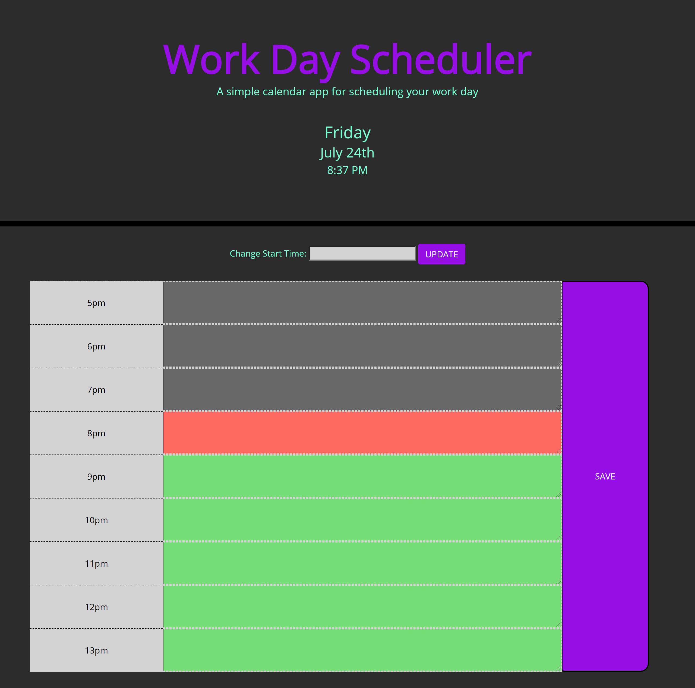

<!-- PROJECT LOGO -->
 

  <h1 align="center">Day Calendar</h1>

<!-- TABLE OF CONTENTS -->
# Table of Contents
* [About the Project](#about-the-project)
    * [Assignment](#assignment)
    * [Finished Project Link](#finished-project)
    * [Project Screenshot](#project-screenshot)
* [Contact](#contact)
* [Acknowledgements](#acknowledgements)

<!-- ABOUT THE PROJECT -->
# About The Project

## Assignment: Third-Party APIs: Work Day Scheduler

Create a simple calendar application that allows the user to save events for each hour of the day. This app will run in the browser and feature dynamically updated HTML and CSS powered by jQuery.

## Technologies Used
    * Basic: HTML, CSS, Javascript
    * Moment.js
    * JQuery
    * Bootstrap 4

## Finished Project
Project Link: [https://br3ndan-l8n.github.io/Day-Calendar/](https://br3ndan-l8n.github.io/Day-Calendar/)

## Project Screenshot

<!-- CONTACT -->
# Contact
* [Email](BR3NDAN.L8N@gmail.com)
* [LinkedIn](https://www.linkedin.com/in/brendan-leighton-ab5944113/)

<!-- ACKNOWLEDGEMENTS -->
# Acknowledgements
* [GitHub Pages](https://pages.github.com)
* [w3schools.com](https://www.w3schools.com/)
* [Google](https://www.google.com/)
